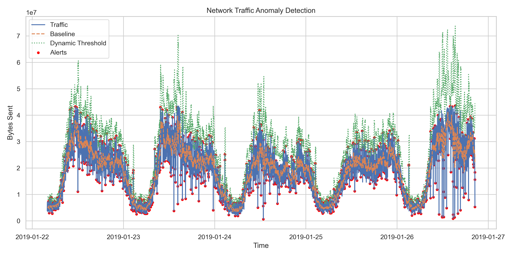

<div align="center">

# 🛡️ Visual Threat Analysis for E-commerce Networks
**High-Performance Log Processing & Statistical Anomaly Detection Pipeline**

[](https://python.org)
[]()
[]()
[](https://opensource.org/licenses/MIT)

A comprehensive data engineering and security analytics pipeline designed to ingest, normalize, and statistically analyze high-volume e-commerce web server logs (3.5+ GB). By establishing dynamic rolling-window baselines, this system successfully identifies coordinated scraping, data exfiltration, and volumetric DDoS patterns without the need for manual static thresholding.

[Key Features](#-core-features) • [Architecture](#-system-architecture) • [Security & Math Models](#-mathematical-model--threat-scoring) • [Dashboard](#-interactive-siem-dashboard)



</div>

---

## 🚀 Core Features

- **Massive-Scale Parsing:** Custom regex ingestion engines capable of translating unstructured `access.log` text into typed, timestamped DataFrames (99.98% extraction rate over 10.3M log lines).
- **Adaptive Threat Detection:** Implements sliding-window standard deviation metrics (`z-score`) to evaluate traffic spikes relative to the *local* time-of-day baseline, dramatically reducing false positives compared to flat thresholding.
- **Outlier Normalization:** Pre-processes the calculation boundary by trimming the upper 1st percentile (`quantile(0.99)`) to prevent structural mass-transfer anomalies from corrupting the baseline average.
- **Automated SIEM Dashboards:** Outputs results into a standalone, offline-ready web dashboard (`HTML/JS/Chart.js`) mimicking enterprise SOC environments, bypassing local CORS restrictions.
- **Power BI Integration:** Includes `.pbix` relational models for enterprise-grade reporting and KPI tracking.

---

## 🏗️ System Architecture

The pipeline executes seamlessly inside a highly serialized Jupyter sequence:

1. **Extraction (ETL Phase I):** 
   * Reads raw `access.log` files mapping standard Nginx/Apache format combinations.
   * Leverages robust error handling to isolate corrupt lines for skipped-record analysis.
2. **Transform & Triage (ETL Phase II):** 
   * Executes deep duplicate sensitivity testing (Identifying ~1.07% exact signature repetition) and evaluates removal impact (only a fractional 4-alert variance detected post-removal).
3. **Time-Series Aggregation:** 
   * Compresses 10 million transactions into 6,686 distinct one-minute `time-bucket` vectors.
4. **Behavioral Inference (Execution):** 
   * Calculates localized short-term volatility (`rolling_mean` window = 10 minutes).
5. **Egress & Visualization:** 
   * Generates analytical `.png` scatter plots.
   * Compiles threat tables into `.csv`/`.xls` formats for the frontend SIEM interface.

---

## 🧮 Mathematical Model & Threat Scoring

### Dynamic Volumetric Thresholding
For any given minute bucket $t$, traffic volume is compared against a 10-minute historical window:

$$ \text{Z-Score}_t = \frac{\text{Bytes}_t - \mu_{rolling}}{\sigma_{rolling}} $$

If $\text{Z-Score}_t > 1.5$, the window is flagged as an active threat vector.

### Custom Risk Severity Function
Not all network spikes pose an equal risk. A `100 KB` payload yielding a high z-score during a quiet baseline is less destructive than a `500 MB` payload doing the same. We calculate absolute **Risk Score** by combining severity confidence with destructive volume mass:

```python
Risk Score = abs(z_score) * (Bytes_Sent / 1000)
```

<details>
<summary><strong>View Severity Classification Matrix</strong></summary>

| Tier | Risk Score Bracket | General Indication |
|---|---|---|
| 🟢 **Low** | $< 300$ | Automated Scanners, Minor Bot Crawling |
| 🟡 **Medium** | $300 - 600$ | Aggressive Scraping, Suspected API abuse |
| 🟠 **High** | $600 - 1000$ | Layer 7 Volumetric Attack initiated |
| 🔴 **Critical** | $> 1000$ | Severe DDoS or active Data Exfiltration |

</details>

---

## 📈 Key Forensic Findings
*(Sampled from production e-commerce log Jan 22 - Jan 26, 2019)*

> [!CAUTION]
> **Primary Incident Identified:** 
> On `January 22, 14:00`, the network experienced the highest concentration of anomaly triggers. 9 specific minute-vectors inside that hour exceeded a Z-Score of 1.5, representing a 30% sustained attack consistency over the hour bucket.

- **Total Analyzed Payload:** 10,363,637 discrete HTTP logs.
- **Alert Frequency:** 870 anomalous windows localized (13.01% trigger rate).
- **Highest Volatility Incident:** Recorded a maximum targeted Risk Score of `678.99`, pushing the network well beyond 2 standard deviations.

---

## 💻 Interactive SIEM Dashboard

We provisioned a completely autonomous, serverless web interface styled after premium SOC tools intended for immediate analytical review.

### Usage Instructions:
1. Clone this repository to your local machine:
   ```bash
   git clone https://github.com/MhdDhanish/Final-Project.git
   ```
2. Navigate to the `Web-Dashboard/` directory.
3. Double-click the `index.html` file to open the dashboard natively in any modern browser.

*(The dashboard loads directly out of `data.js`, meaning absolutely no backend server, node dependencies, or database configuration is required to view the interactive Chart.js modules).*

---

### Project Maintainer
**Author:** Mhd Dhanish  
**University ID:** 23BCCDD035  
**Course Context:** Visual Threat Hunting & Network Defense Operations
